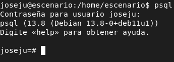
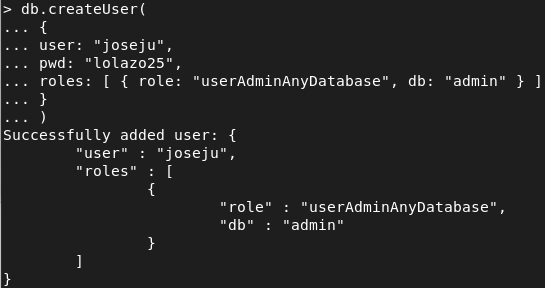

# Alumno 2

---

## Instalación Oracle 19c en Debian 11

## Configuración Oracle 19c en Debian 11

---

## Instalación MariaDB en Debian 11

- Primero actualizamos el sistema:

```bash
sudo apt update -y && sudo apt upgrade -y
```

- Instalamos el paquete mariadb-server:

```bash
sudo apt install -y mariadb-server
```

- Comprobamos el estado del servicio postgres para comprobar que funciona:


## Configuración MariaDB en Debian 11

---

## Instalación Postgres en Debian 11

- Primero actualizamos el sistema:

```bash
sudo apt update -y && sudo apt upgrade -y
```

- Instalamos el paquete postgresql-13:

```bash
sudo apt install -y postgresql-13
```

- Comprobamos el estado del servicio postgres para comprobar que funciona:


## Configuración Postgres en Debian 11

### Creación y configuración de usuarios

- Con el siguiente comando creamos al usuario joseju como un superusuario:

```bash
sudo -u postgres createuser joseju --interactive -P
```


### Creación de una base de datos

- Ahora creamos una base de datos llamada libreria:


- Cambiamos a la base de datos recien creada:

```sql
joseju=# \c libreria
You are now connected to database "libreria" as user "joseju".
```

- A continuación crearemos las tablas de esta base de datos:

```sql
libreria=# CREATE TABLE usuarios (
   ID SERIAL PRIMARY KEY,
   NOMBRE varchar(20),
   PASSWORD char(102),
   FULLNAME varchar(50)
);
CREATE TABLE

libreria=# CREATE TABLE autor (
   id SERIAL PRIMARY KEY,
   nombre varchar(20),
   apellidos varchar(20)
);
CREATE TABLE

libreria=# CREATE TABLE libros (
   id SERIAL PRIMARY KEY,
   idautor SERIAL,
   nombre varchar(20),
   constraint FK_autor foreign key (idautor) references autor(id)
);
CREATE TABLE

libreria=# CREATE TABLE compralibro (
   idcliente SERIAL,
   idlibro SERIAL,
   primary key(idcliente,idlibro),
   constraint FK_cliente foreign key (idcliente) references usuarios(id),
   constraint FK_libro foreign key (idlibro) references libros(id)
);
CREATE TABLE
```

- Mostramos las tablas que acabamos de crear:

```sql
libreria=# \dt
           List of relations
 Schema |    Name     | Type  | Owner  
--------+-------------+-------+--------
 public | autor       | table | joseju
 public | compralibro | table | joseju
 public | libros      | table | joseju
 public | usuarios    | table | joseju
(4 rows)
```

### Activar uso de contraseña

- Para activar el uso de contraseña, cambiamos dentro del fichero de configuración pg_hba.conf la siguiente directiva y cambiamos la palabra peer por md5:


- Una vez modificado, reiniciamos el servicio:

```bash
systemctl reload postgresql
```

- Iniciamos postgres para ver si nos pide la contraseña:



### Configurar Acceso remoto

Para configurar el acceso remoto, debemos modificar dos ficheros, postgresql.conf y pg_hba.conf y modificar las siguientes líneas:

- En el fichero postgresql.conf indicamos la dirección IP de nuestro servidor:


- En el fichero ph_hba.conf_ habilitaremos el uso de contraseña:


Reiniciamos el servicio y en el apartado de prueba conexion servidor postgres comprobamos que funciona.

---

## Instalación MongoDB en Debian 11

- En primer lugar instalamos las dependencias necesarias:

```bash
apt-get install curl apt-transport-https software-properties-common gnupg2 -y
```

- Seguidamente, añadimos la clave GPG y también añadimos el repositorio de mongodb:

```bash
wget -qO - https://www.mongodb.org/static/pgp/server-4.4.asc | apt-key add -
```

```bash
echo "deb http://repo.mongodb.org/apt/debian buster/mongodb-org/4.4 main" | tee /etc/apt/sources.list.d/mongodb-org.list
```

- A continuación, actualizamos el sistema e instalamos el paquete mongodb-org:

```bash
sudo apt update -y && sudo apt install mongodb-org -y
```

- Ahora, iniciamos el servicio de mongo:

```bash
sudo systemctl start mongod && sudo systemctl enable mongod
```

- Finalmente verificamos la version de mongo que hemos instalado:

```bash
mongod --version
```


## Configuración MongoDB en Debian 11

### Habilitar la autenticación en mongodb

Por defecto, la autenticación en mongodb no esta habilitada, así que por razones de seguridad, habilitaremos la autentiación. Para ello haremos lo siguiente:

- Primero iniciamos la shell de mongo:

```bash
mongo
```

- Seguidamente creamos una base de datos llamada admin:

```sql
use admin
```

- Ahora, creamos nuestro usuario e introducimos una contraseña:

```json
db.createUser(
{
user: "joseju",
pwd: "lolazo25",
roles: [ { role: "root", db: "admin" } ]
}
)
```



- A continuación, pulsamos ctrl+D para salir de mongo, y editamos el archivo de configuración /etc/mongo.conf añadiendo las siguientes líneas para activar la autenticación:


- Reiniciamos mongo e intentamos acceder para ver si no pide las credenciales:


### Crear base de datos

Procederemos a crear una base de datos llamada libreria con tres colecciones y con información variada, las colecciones que crearemos serán:

- usuario

- libro

- autor

Dentro de la colección usuario, almacenaremos los datos del usuario, su contraseña para acceder al sistema, su nombre y su id.

Dentro de la colección libros, almacenaremos los datos de los libros, el nombre del libro, el autor que escribio el libro y su id.

Dentro de la colección autores, almacenaremos los datos de los autores, el nombre y apellidos del autor y su id.

En mongo, las bases de datos que se crean son de tipo no relacionales, es decir, no se crean mediante tablas, claves... Sino mediante json.

Lo primero que haremos para crear las colecciones:

```bash
> use libreria;
switched to db libreria
> db.createCollection("usuarios")
{ ok: 1 }
> db.createCollection("libros")
{ ok: 1 }
> db.createCollection("autores")
{ ok: 1 }
```

Comprobamos que hemos creado los documentos:

```bash
> show collections
usuarios
libros
autores
```

Insertamos los siguientes documentos:

```json
db.usuarios.insertMany( [
{id: 1, 
usuario: "joseju", 
password: "pbkdf2:sha256:260000$FHhIsLue8dRwFAIM$ef37e5b262fb3d687112e232cd47abf1ec83f4c653b7bcbf95fa3993298fb5df", 
fullname: "Jose Juan"} 
] )

db.libros.insertMany( [
{ id: 100,
nombre: "El Quijote",
autor: "Cervantes"}
] )

db.autores.insertMany( [
{id: 1000,
autname: "Cervantes",
nombre: "Miguel",
apellidos: "Cervantes Saavedra"}
] )
```

Compruebo que se ha añadido todo correctamente:

```bash
> db.usuarios.find()
[
  {
    _id: ObjectId("635e7fe5024ab00ff3a1377c"),
    id: 1,
    usuario: 'joseju',
    password: 'pbkdf2:sha256:260000$FHhIsLue8dRwFAIM$ef37e5b262fb3d687112e232cd47abf1ec83f4c653b7bcbf95fa3993298fb5df',
    fullname: 'Jose Juan'
  }
]
> db.libros.find()
[
  {
    _id: ObjectId("635e838d024ab00ff3a1377d"),
    id: 100,
    nombre: 'El Quijote',
    autor: 'Cervantes'
  }
]
> db.autores.find()
[
  {
    _id: ObjectId("635e8399024ab00ff3a1377e"),
    id: 1000,
    autname: 'Cervantes',
    nombre: 'Miguel',
    apellidos: 'Cervantes Saavedra'
  }
]
```

### Configuración Acceso remoto

Para la configuración del acceso remoto haremos lo siguiente:

- Modificaremos el fichero de configuración /etc/mongod.conf y en el parámetro e bindIp dentro del apartado net, establecemo el valor 0.0.0.0:


Reiniciamos el servicio de mongo y comprobamos que funciona en el apartado de cliente remoto mongodb. 

---

## Prueba Cliente Remoto MongoDB

- Dentro del cliente, añadimos la clave gpg y repositorio de mongo, actualizamos los repositorios e instalamos el cliente remoto de mongodb, que en nuestro caso se llama mongosh:

```bash
wget -qO - https://www.mongodb.org/static/pgp/server-4.4.asc | apt-key add -
```

```bash
echo "deb http://repo.mongodb.org/apt/debian buster/mongodb-org/4.4 main" | tee /etc/apt/sources.list.d/mongodb-org.list
```

```bash
sudo apt update && sudo apt install mongosh
```

- Una vez hemos instalado el cliente de mongo, ejecutamos el siguiente comando para conectarnos al servidor de mongo:

```bash
mongosh --host 192.168.1.42 -u joseju
```


---

## Realización de Aplicacion Web